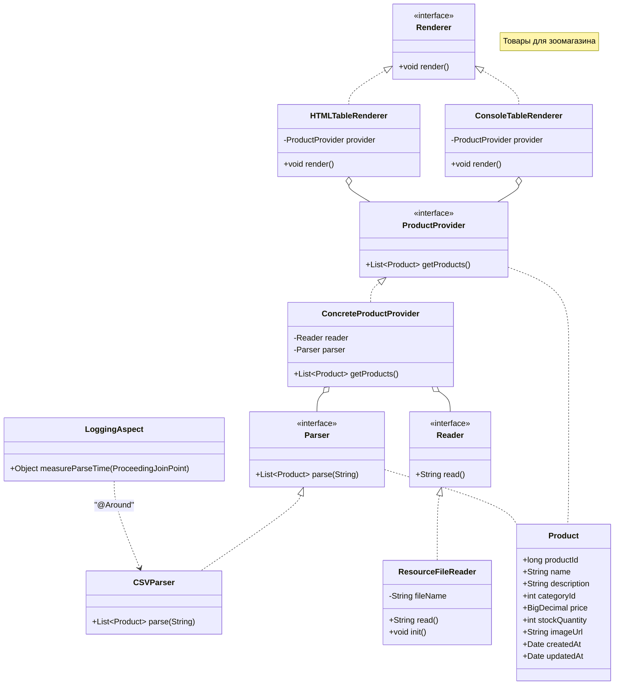

# Отчёт о лабораторной работе 2. Конфигурирование Spring с помощью аннотаций. АОП для логирования

## Цель работы

Перевести приложение зоомагазина с Java-конфигурации на аннотационную конфигурацию Spring (`@Component`, `@Autowired`, `@Value`). Добавить вывод в HTML-файл, отслеживание жизненного цикла бина и измерение времени парсинга CSV с помощью АОП.

## Выполнение работы

### 1. Переход на аннотационную конфигурацию

Класс `AppConfig` заменён на минимальный `@Configuration` с `@ComponentScan`:

```java
@Configuration
@ComponentScan(basePackages = "ru.bsuedu.cad.lab")
@EnableAspectJAutoProxy
@PropertySource("classpath:application.properties")
public class AppConfig {}
```

Все классы (`ResourceFileReader`, `CSVParser`, `ConcreteProductProvider`, `ConsoleTableRenderer`, `HTMLTableRenderer`, `LoggingAspect`) аннотированы `@Component`. Зависимости внедряются через конструктор с `@Autowired`.

### 2. Имя файла из `application.properties` через `@Value` и SpEL

Файл `src/main/resources/application.properties`:
```properties
product.file=products.csv
```

В `ResourceFileReader` имя файла внедряется через конструктор:
```java
public ResourceFileReader(@Value("${product.file}") String fileName) { ... }
```

### 3. HTMLTableRenderer — основной рендерер

Добавлен класс `HTMLTableRenderer`, аннотированный `@Primary`. Он формирует HTML-страницу с таблицей товаров и сохраняет её в файл `products.html`. `ConsoleTableRenderer` оставлен как запасная реализация без `@Primary`.

### 4. Жизненный цикл бина — `@PostConstruct`

В `ResourceFileReader` добавлен метод с аннотацией `@PostConstruct`, который выводит дату и время завершения инициализации бина:

```
ResourceFileReader инициализирован: 2026-05-03T14:13:03.324015300
```

### 5. АОП — измерение времени парсинга

Класс `LoggingAspect` с аннотацией `@Aspect` перехватывает вызов `CSVParser.parse()` через совет `@Around`:

```
Парсинг CSV выполнен за 21 мс
```

Добавленные зависимости: `org.aspectj:aspectjweaver:1.9.22.1`, `jakarta.annotation:jakarta.annotation-api:2.1.1`.

### 6. Запуск приложения

```bash
gradle run
```

Вывод:
```
ResourceFileReader инициализирован: 2026-05-03T14:13:03.324015300
Парсинг CSV выполнен за 21 мс
HTML-таблица сохранена в файл: products.html
```

## UML-диаграмма классов



## Выводы

В ходе работы освоено аннотационное конфигурирование Spring-приложений: `@Component`, `@Autowired`, `@Value`, `@PostConstruct`. Конфигурация стала компактнее — класс `AppConfig` больше не содержит явного создания бинов. Механизм `@Primary` позволяет выбрать активную реализацию интерфейса без изменения точки входа. АОП с аннотацией `@Around` обеспечивает неинвазивное измерение производительности без изменения бизнес-кода.
