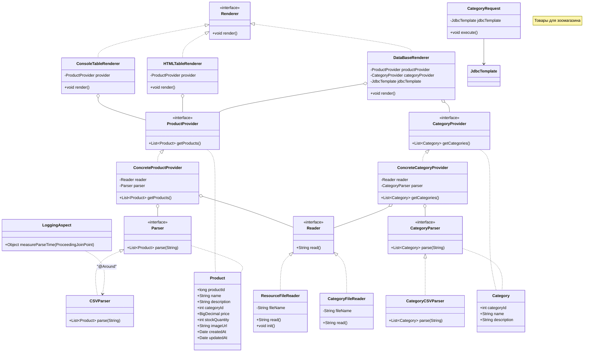

# Отчёт о лабораторной работе 4. Технологии работы с базами данных. JDBC

## Цель работы

Подключить встраиваемую БД H2, научить приложение сохранять данные из CSV-файлов в таблицы CATEGORIES и PRODUCTS через Spring JDBC (JdbcTemplate), реализовать SQL-запрос с логированием результатов через Logback.

## Выполнение работы

### 1. Подключение H2 через EmbeddedDatabaseBuilder

В `AppConfig` добавлен бин DataSource на основе H2 с выполнением DDL-скрипта при старте:

```java
@Bean
public DataSource dataSource() {
    return new EmbeddedDatabaseBuilder()
            .setType(EmbeddedDatabaseType.H2)
            .addScript("classpath:db/schema.sql")
            .build();
}

@Bean
public JdbcTemplate jdbcTemplate(DataSource dataSource) {
    return new JdbcTemplate(dataSource);
}
```

### 2. SQL-скрипт схемы (db/schema.sql)

Создаются таблицы CATEGORIES и PRODUCTS с внешним ключом category_id:

```sql
CREATE TABLE IF NOT EXISTS CATEGORIES (
    category_id INT PRIMARY KEY,
    name        VARCHAR(255) NOT NULL,
    description VARCHAR(255)
);

CREATE TABLE IF NOT EXISTS PRODUCTS (
    product_id     INT PRIMARY KEY,
    ...
    category_id    INT,
    FOREIGN KEY (category_id) REFERENCES CATEGORIES(category_id)
);
```

### 3. Модель Category и ConcreteCategoryProvider

Добавлен класс `Category` (аналог `Product`). Для чтения категорий созданы:
- `CategoryParser` / `CategoryCSVParser` — парсинг CSV
- `CategoryFileReader` (`@Component("categoryFileReader")`) — чтение из `category.csv`
- `ConcreteCategoryProvider` — использует `@Qualifier("categoryFileReader")`

`ResourceFileReader` получил имя `@Component("productFileReader")`, `ConcreteProductProvider` — `@Qualifier("productFileReader")`.

### 4. DataBaseRenderer (@Primary)

`DataBaseRenderer` сохраняет категории и продукты из CSV-провайдеров в БД через `JdbcTemplate.update()`. Аннотирован `@Primary`, заменив `HTMLTableRenderer` в качестве дефолтного рендерера.

### 5. CategoryRequest — запрос к БД + Logback

Класс `CategoryRequest` выполняет SQL:
```sql
SELECT c.category_id, c.name, COUNT(p.product_id) AS product_count
FROM CATEGORIES c JOIN PRODUCTS p ON c.category_id = p.category_id
GROUP BY c.category_id, c.name
HAVING COUNT(p.product_id) > 1
```

Результат выводится на уровне INFO через SLF4J/Logback.

### 6. Запуск и вывод

```bash
gradle run
```

```
ResourceFileReader инициализирован: 2026-05-03T14:20:11.577074400
Парсинг CSV выполнен за 18 мс
Данные успешно сохранены в базу данных.
14:20:11.845 [main] INFO  r.b.cad.lab.query.CategoryRequest - Категории с более чем одним товаром:
14:20:11.847 [main] INFO  r.b.cad.lab.query.CategoryRequest -   id=5, name='Средства ухода', кол-во товаров=2
```

## UML-диаграмма классов



## Выводы

В ходе работы освоена работа с базами данных через Spring JDBC. `EmbeddedDatabaseBuilder` обеспечивает автоматическое создание схемы БД при старте приложения без ручной настройки подключения. `JdbcTemplate` существенно упрощает выполнение SQL-запросов, избавляя от шаблонного кода управления соединениями и исключениями. Logback позволяет управлять уровнями вывода: Spring-фреймворк выводит на уровне WARN, приложение — на INFO.
