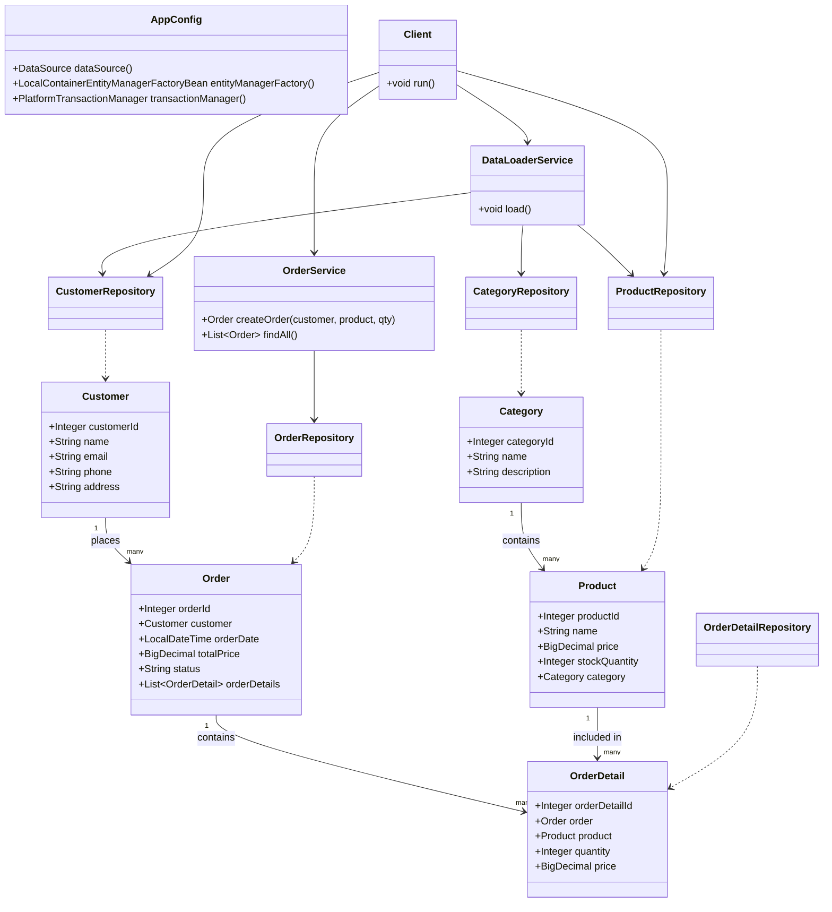

# Отчёт о лабораторной работе 5. JPA. Spring Data

## Цель работы

Перейти с Spring JDBC на ORM Hibernate и Spring Data JPA. Реализовать слоистую архитектуру приложения с JPA-сущностями, репозиториями Spring Data, сервисами и клиентом. Создание заказа должно выполняться в рамках транзакции.

## Выполнение работы

### 1. DataSource — HikariCP + H2

В `AppConfig` создаётся `HikariDataSource` с in-memory базой H2:

```java
HikariConfig cfg = new HikariConfig();
cfg.setJdbcUrl("jdbc:h2:mem:shopdb;DB_CLOSE_DELAY=-1");
cfg.setDriverClassName("org.h2.Driver");
return new HikariDataSource(cfg);
```

### 2. JPA / Hibernate

`LocalContainerEntityManagerFactoryBean` сканирует пакет `ru.bsuedu.cad.lab.entity`. Схема создаётся автоматически (`hibernate.hbm2ddl.auto=create-drop`).

```java
@Bean
public LocalContainerEntityManagerFactoryBean entityManagerFactory(DataSource ds) { ... }

@Bean
public PlatformTransactionManager transactionManager(EntityManagerFactory emf) {
    return new JpaTransactionManager(emf);
}
```

### 3. Структура пакетов

```
ru.bsuedu.cad.lab
├── app         — Client (точка запуска логики)
├── config      — AppConfig
├── entity      — JPA-сущности
├── repository  — Spring Data репозитории
└── service     — DataLoaderService, OrderService
```

### 4. JPA-сущности

| Сущность | Таблица | Ключ |
|---|---|---|
| `Category` | CATEGORIES | Вручную (из CSV) |
| `Product` | PRODUCTS | Вручную (из CSV), FK → CATEGORIES |
| `Customer` | CUSTOMERS | Вручную (из CSV) |
| `Order` | ORDERS | IDENTITY, FK → CUSTOMERS |
| `OrderDetail` | ORDER_DETAILS | IDENTITY, FK → ORDERS, PRODUCTS |

### 5. Репозитории (Spring Data JPA)

По одному `JpaRepository<Entity, Integer>` для каждой сущности. Методы `save()`, `findById()`, `findAll()` доступны из коробки.

### 6. Сервисы

`DataLoaderService` — читает CSV-файлы (category.csv, product.csv, customer.csv) из classpath и сохраняет данные через репозитории в одной транзакции (`@Transactional`).

`OrderService` — создаёт заказ с позицией (`@Transactional`) и возвращает список всех заказов.

### 7. Клиент и вывод

```
14:26:03.478 [main] INFO  Client - Создан заказ: id=1, покупатель='Алексей Иванов', товар='Сухой корм для собак', кол-во=2, итого=3000.00, статус=NEW
14:26:03.481 [main] INFO  Client - Все заказы в БД:
14:26:03.562 [main] INFO  Client -   id=1, покупатель='Алексей Иванов', итого=3000.00, дата=2026-05-03T14:26:03
```

Повторный запрос `findAll()` после `createOrder()` подтверждает, что заказ сохранился в БД.

## UML-диаграмма классов



## Выводы

Переход на JPA и Spring Data значительно сократил объём кода: репозитории сводятся к пустым интерфейсам, Spring Data генерирует реализации автоматически. Hibernate создаёт схему БД из аннотаций без SQL-скриптов. Аннотация `@Transactional` гарантирует атомарность операций — при ошибке все изменения откатываются.
