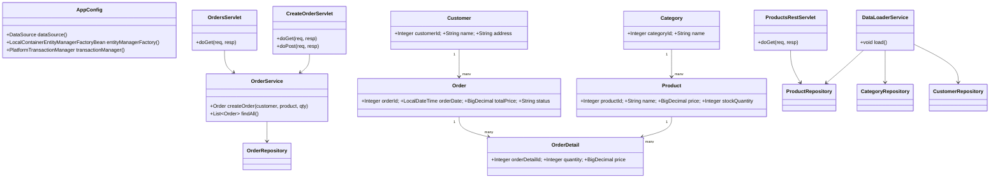

# Отчёт о лабораторной работе 5. Разработка и развёртывание Web-приложений

## Цель работы

Превратить консольное приложение в Web-приложение: настроить сборку WAR, интегрировать Spring-контекст с сервлет-контейнером Tomcat 11, реализовать сервлеты для просмотра и создания заказов, а также REST-сервис для продуктов.

## Выполнение работы

### 1. Сборка WAR

В `build.gradle.kts` плагин `application` заменён на `war`. Servlet API добавлен как `compileOnly`:

```kotlin
plugins { war }
compileOnly("jakarta.servlet:jakarta.servlet-api:6.0.0")
implementation("org.springframework:spring-web:6.2.2")
implementation("com.fasterxml.jackson.core:jackson-databind:2.17.2")
```

Сборка: `gradle war` → `build/libs/product-table.war`

### 2. Интеграция Spring с Tomcat — web.xml

`ContextLoaderListener` инициализирует Spring ApplicationContext при старте Tomcat:

```xml
<context-param>
    <param-name>contextClass</param-name>
    <param-value>...AnnotationConfigWebApplicationContext</param-value>
</context-param>
<context-param>
    <param-name>contextConfigLocation</param-name>
    <param-value>ru.bsuedu.cad.lab.config.AppConfig</param-value>
</context-param>
<listener>
    <listener-class>...ContextLoaderListener</listener-class>
</listener>
```

### 3. Автозагрузка данных

`DataLoaderService` загружает CSV-данные при старте контекста через `@EventListener(ContextRefreshedEvent.class)`. Повторная загрузка исключается проверкой `categoryRepository.count() > 0`.

### 4. Получение Spring-бинов в сервлетах

```java
var ctx = WebApplicationContextUtils.getRequiredWebApplicationContext(getServletContext());
OrderService orderService = ctx.getBean(OrderService.class);
```

### 5. Сервлеты

| URL | Класс | Описание |
|---|---|---|
| `GET /orders` | `OrdersServlet` | HTML-таблица заказов + кнопка «Создать» |
| `GET /orders/create` | `CreateOrderServlet` | Форма: покупатель, товар, количество |
| `POST /orders/create` | `CreateOrderServlet` | Создаёт заказ, редирект на `/orders` |
| `GET /api/products` | `ProductsRestServlet` | JSON: название, категория, остаток |

### 6. REST-сервис `/api/products`

Jackson сериализует список продуктов в JSON:
```json
[
  {"name":"Сухой корм для собак","categoryName":"Корма","stockQuantity":50},
  {"name":"Игрушка для кошек \"Мышка\"","categoryName":"Игрушки","stockQuantity":200}
]
```

### 7. Деплой на Tomcat 11

1. Скопировать `product-table.war` в `$TOMCAT_HOME/webapps/`
2. Запустить: `bin/startup.bat`
3. Список заказов: `http://localhost:8080/product-table/orders`
4. Создать заказ: `http://localhost:8080/product-table/orders/create`
5. REST API: `GET http://localhost:8080/product-table/api/products`

## UML-диаграмма классов



## Выводы

`ContextLoaderListener` обеспечивает интеграцию Spring-контекста с жизненным циклом Tomcat без изменения бизнес-логики. `@WebServlet` устраняет необходимость регистрировать сервлеты в `web.xml`. Разделение на HTML-сервлеты и REST-сервлет демонстрирует оба подхода к веб-интерфейсу в одном приложении.
