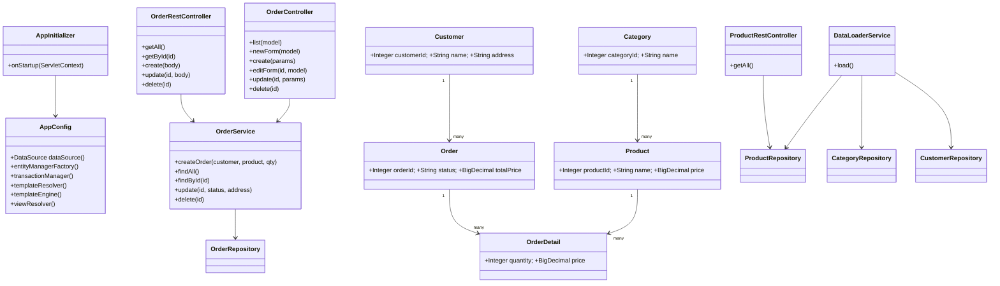

# Отчёт о лабораторной работе 6. Spring MVC + Thymeleaf

## Цель работы

Перейти с низкоуровневых сервлетов на Spring MVC: настроить `DispatcherServlet` через `WebApplicationInitializer`, реализовать REST API и веб-интерфейс заказов с Thymeleaf.

## Выполнение работы

### 1. Настройка Spring MVC

Вместо `web.xml` используется `AppInitializer implements WebApplicationInitializer`:

```java
public void onStartup(ServletContext container) {
    var context = new AnnotationConfigWebApplicationContext();
    context.register(AppConfig.class);
    var dispatcher = container.addServlet("dispatcher", new DispatcherServlet(context));
    dispatcher.setLoadOnStartup(1);
    dispatcher.addMapping("/");
}
```

В `AppConfig` добавлены аннотация `@EnableWebMvc` и бины Thymeleaf (`ClassLoaderTemplateResolver`, `SpringTemplateEngine`, `ThymeleafViewResolver`). Поддержка `LocalDateTime` в Jackson — через `JavaTimeModule`.

### 2. REST API заказов (`/api/orders`)

| Метод | URL | Описание |
|---|---|---|
| GET | `/api/orders` | Список всех заказов |
| GET | `/api/orders/{id}` | Заказ по ID |
| POST | `/api/orders` | Создать: `{"customerId":1,"productId":1,"quantity":2}` |
| PUT | `/api/orders/{id}` | Обновить: `{"status":"PAID","shippingAddress":"..."}` |
| DELETE | `/api/orders/{id}` | Удалить |

Также сохранён `GET /api/products` из предыдущей работы.

### 3. Веб-интерфейс Thymeleaf (`/orders`)

| URL | Шаблон | Описание |
|---|---|---|
| `GET /orders` | `orders.html` | Таблица заказов, кнопки «Изменить» / «Удалить» |
| `GET /orders/new` | `order-form.html` | Форма создания |
| `POST /orders` | — | Создание, редирект на `/orders` |
| `GET /orders/{id}/edit` | `order-edit.html` | Форма редактирования статуса и адреса |
| `POST /orders/{id}/edit` | — | Обновление, редирект |
| `POST /orders/{id}/delete` | — | Удаление, редирект |

### 4. Сборка и деплой

```bash
gradle war   # → build/libs/product-table.war
```

Скопировать WAR в `$TOMCAT_HOME/webapps/`, запустить `bin/startup.bat`.

- Веб-интерфейс: `http://localhost:8080/product-table/orders`
- REST API: `http://localhost:8080/product-table/api/orders`

## UML-диаграмма классов



## Выводы

`DispatcherServlet` как единая точка входа упрощает маршрутизацию — не нужно регистрировать каждый сервлет вручную. `@RestController` возвращает JSON напрямую без `ObjectMapper.writeValue()`. Thymeleaf-шаблоны с Bootstrap обеспечивают читаемый HTML с минимальным кодом. `@Transactional` в сервисном слое гарантирует консистентность операций с БД.
