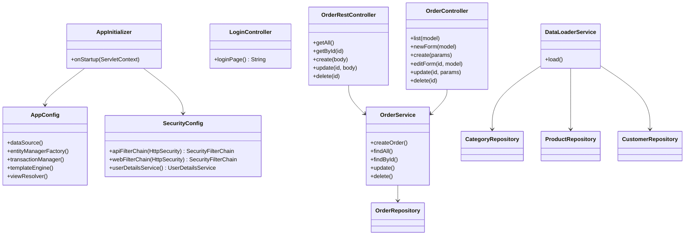

# Отчёт о лабораторной работе 7. Spring Security. Basic Authentication

## Цель работы

Добавить ролевой доступ: форменная аутентификация для веб-интерфейса и Basic Auth для REST API. Пользователь `user` — только просмотр заказов; `manager` — полный доступ.

## Выполнение работы

### 1. Зависимости

```kotlin
implementation("org.springframework.security:spring-security-web:6.2.2")
implementation("org.springframework.security:spring-security-config:6.2.2")
implementation("org.thymeleaf.extras:thymeleaf-extras-springsecurity6:3.1.1.RELEASE")
```

### 2. Регистрация фильтра безопасности (AppInitializer)

`DelegatingFilterProxy` зарегистрирован вручную в `AppInitializer` до `DispatcherServlet`. Оба бина (`AppConfig` и `SecurityConfig`) размещены в одном Spring-контексте:

```java
container.addFilter("springSecurityFilterChain",
    new DelegatingFilterProxy("springSecurityFilterChain"))
    .addMappingForUrlPatterns(..., "/*");

context.register(AppConfig.class, SecurityConfig.class);
```

### 3. SecurityConfig — две цепочки фильтров

**Цепочка 1 — REST API** (`/api/**`, `@Order(1)`):

- Basic Authentication, stateless сессия
- `GET /api/**` — роли USER и MANAGER
- остальные методы — только MANAGER

**Цепочка 2 — веб-интерфейс** (`/orders/**`, `@Order(2)`):

- Form Login, страница `/login`
- `GET /orders` — USER и MANAGER
- остальные `/orders/**` — только MANAGER

### 4. Пользователи (InMemoryUserDetailsManager)

| Логин | Пароль | Роль | Доступ |
|---|---|---|---|
| `user` | `user` | ROLE_USER | GET /orders, GET /api/orders |
| `manager` | `manager` | ROLE_MANAGER | все операции |

### 5. Страница логина

Создан `LoginController` (`GET /login`) и шаблон `login.html` с Bootstrap-формой. Отображает подсказки по логинам, сообщения об ошибке и успешном выходе.

### 6. Thymeleaf Security — скрытие кнопок по роли

`SpringSecurityDialect` добавлен в `SpringTemplateEngine`. В `orders.html` кнопки «Создать», «Изменить», «Удалить» скрыты для роли USER через `sec:authorize`:

```html
<a sec:authorize="hasRole('MANAGER')" href="...">Создать заказ</a>
<th sec:authorize="hasRole('MANAGER')">Действия</th>
```

### 7. Сборка и деплой

```bash
gradle war   # → build/libs/product-table.war
```

Деплой в `$TOMCAT_HOME/webapps/`.

| URL | Аутентификация | Описание |
|---|---|---|
| `http://localhost:8080/product-table/orders` | Form Login | Список заказов |
| `http://localhost:8080/product-table/api/orders` | Basic Auth | REST API |

Тест REST через Postman: `Authorization: Basic` с `manager:manager`.

## UML-диаграмма классов



## Выводы

Spring Security позволяет разделить аутентификацию для web-интерфейса (Form Login) и API (Basic Auth) через две `SecurityFilterChain` с разными `securityMatcher`. `InMemoryUserDetailsManager` подходит для учебных целей — в продакшне следует использовать БД или LDAP. `thymeleaf-extras-springsecurity6` делает управление видимостью элементов декларативным прямо в шаблоне без серверного кода.
