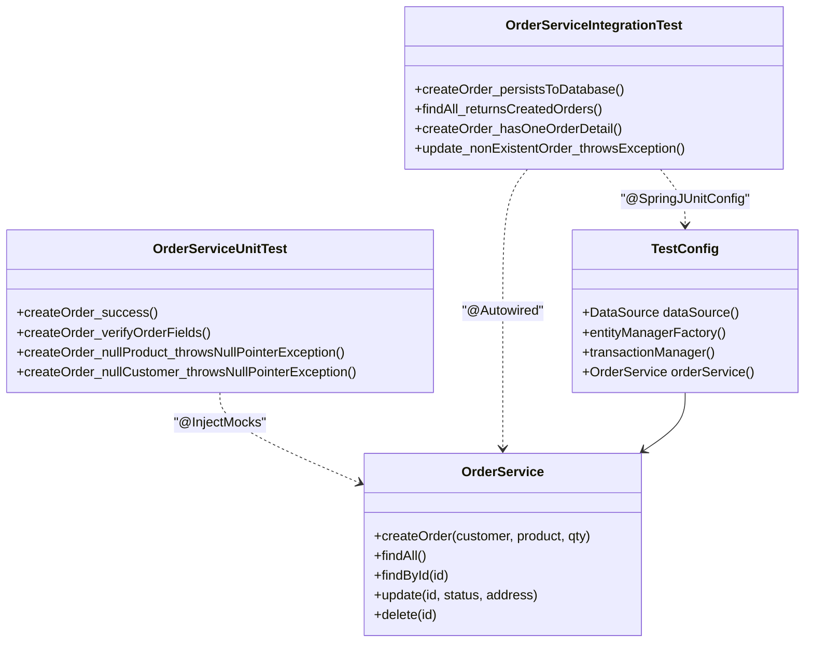

# Отчёт о лабораторной работе 8. Основы тестирования

## Цель работы

Настроить unit и интеграционное тестирование для `OrderService`, подключить JaCoCo для отчёта о покрытии кода.

## Выполнение работы

### 1. Зависимости и конфигурация тестирования

В `build.gradle.kts` добавлен плагин `jacoco` и тестовые зависимости:

```kotlin
plugins { war; jacoco }

testImplementation("org.mockito:mockito-core:5.17.0")
testImplementation("org.mockito:mockito-junit-jupiter:5.17.0")
testImplementation("org.springframework:spring-test:6.2.2")
testImplementation("org.assertj:assertj-core:3.25.3")
testRuntimeOnly("com.h2database:h2:2.2.224")
```

JaCoCo настроен на генерацию HTML-отчёта:

```kotlin
tasks.named<Test>("test") {
    useJUnitPlatform()
    finalizedBy(tasks.jacocoTestReport)
}
tasks.jacocoTestReport {
    reports { html.outputLocation = layout.buildDirectory.dir("reports/jacoco/html") }
}
```

### 2. Unit-тесты (`OrderServiceUnitTest`)

Используют `@ExtendWith(MockitoExtension.class)`. `OrderRepository` замокирован через `@Mock`. Тестируемый класс создаётся через `@InjectMocks`.

| Тест | Сценарий |
|---|---|
| `createOrder_success` | Мок возвращает сохранённый заказ, проверяются id, статус, сумма |
| `createOrder_verifyOrderFields` | Проверяются поля переданного в save() заказа |
| `createOrder_nullProduct_throwsNullPointerException` | `null` продукт → NPE до обращения к репозиторию |
| `createOrder_nullCustomer_throwsNullPointerException` | `null` покупатель → NPE |

### 3. Интеграционные тесты (`OrderServiceIntegrationTest`)

Используют `@SpringJUnitConfig(TestConfig.class)`. `TestConfig` подымает минимальный Spring-контекст: H2 in-memory, Hibernate (create-drop), Spring Data репозитории, `OrderService`. Каждый тест запускается в `@Transactional` транзакции, которая откатывается после завершения.

| Тест | Сценарий |
|---|---|
| `createOrder_persistsToDatabase` | Заказ реально сохраняется в H2, проверяются все поля |
| `findAll_returnsCreatedOrders` | Два созданных заказа возвращаются списком |
| `createOrder_hasOneOrderDetail` | Заказ содержит ровно одну позицию с правильной суммой |
| `update_nonExistentOrder_throwsException` | `update(999, ...)` бросает `NoSuchElementException` |

### 4. Результаты тестирования

```
8 tests completed, 0 failed
BUILD SUCCESSFUL
```

Отчёт о покрытии: `build/reports/jacoco/html/index.html`
Отчёт о тестах: `build/reports/tests/test/index.html`

### 5. TestConfig — изолированный контекст для интеграционных тестов

```java
@Configuration
@EnableJpaRepositories(basePackages = "ru.bsuedu.cad.lab.repository")
@EnableTransactionManagement
public class TestConfig {
    @Bean DataSource dataSource() { return new EmbeddedDatabaseBuilder()... }
    @Bean LocalContainerEntityManagerFactoryBean entityManagerFactory() { ... }
    @Bean OrderService orderService(OrderRepository repo) { return new OrderService(repo); }
}
```

Не использует `@ComponentScan` — DataLoaderService и веб-слой не попадают в тестовый контекст.

## UML-диаграмма классов (тестовый слой)



## Выводы

Unit-тесты с Mockito изолируют сервис от БД — они быстры и проверяют бизнес-логику. Интеграционные тесты с реальным H2 проверяют взаимодействие со слоем репозиториев без моков. `@Transactional` на тестовом классе откатывает каждый тест, обеспечивая изолированность данных. JaCoCo показывает покрытие сервисного слоя и помогает выявить непокрытые ветки.
